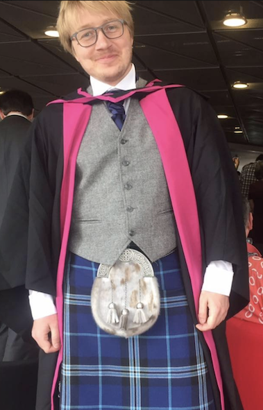

# Eugene Kharitonov 👋

---

## About Me

Hi there! I am currently working at [Kyutai](https://kyutai.org) (a non-profit open-research lab) as a Technical Staff.

Before, I was a Research Scientist at Google DeepMind (coming from Google Brain) and worked as a Research Engineer at Facebook AI Research (FAIR).

My current research is focused on **speech and speech-text LLMs**. I co-first-authored the [very first paper](https://aclanthology.org/2021.tacl-1.79/) that applied Transformer-based generative language modeling on quantized speech representations.
Fast-forward a few short years and this idea became one of the mainstream approaches for generative audio and ended up powering speech capabilities of the modern industrial-scale LLMs such as Gemini.

Even earlier, I used to work on understanding the internal workings of deep learning models, studied communicating neural agents, dipped my toes in Federated Learning and a few other exciting topics!

I earned my PhD at the University of Glasgow.

